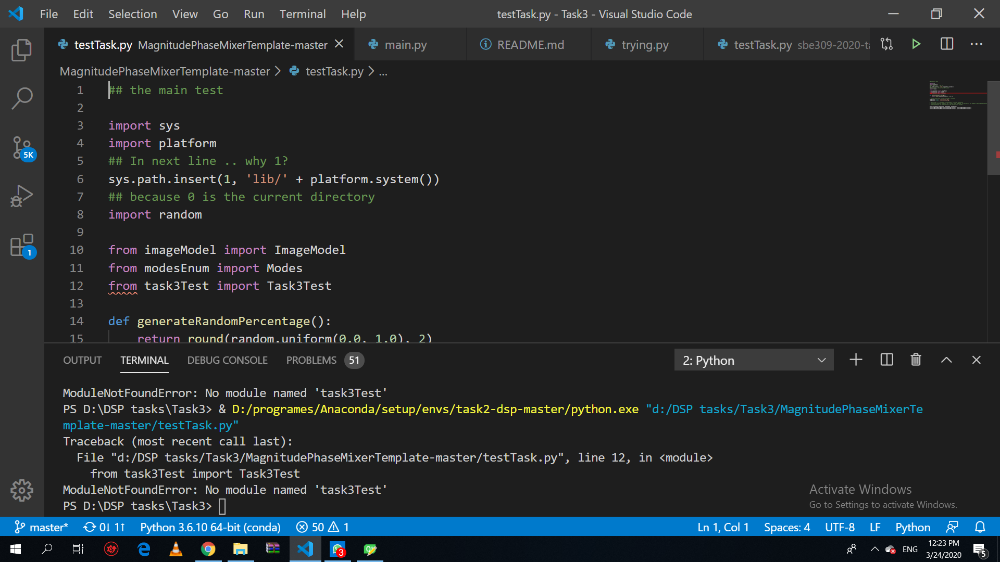
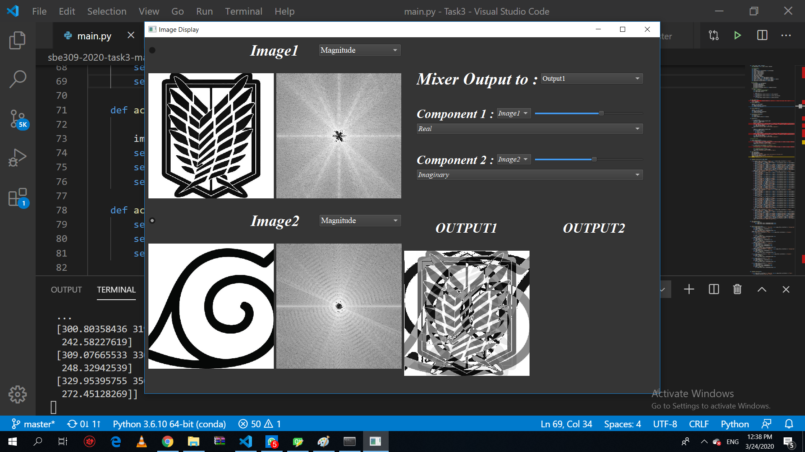
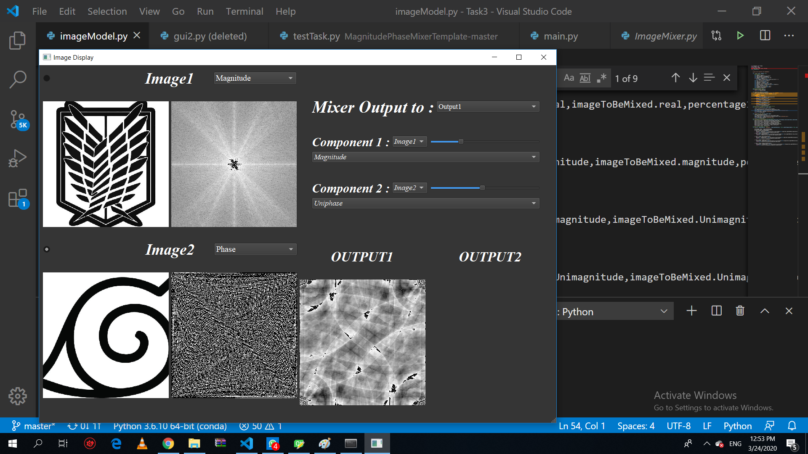
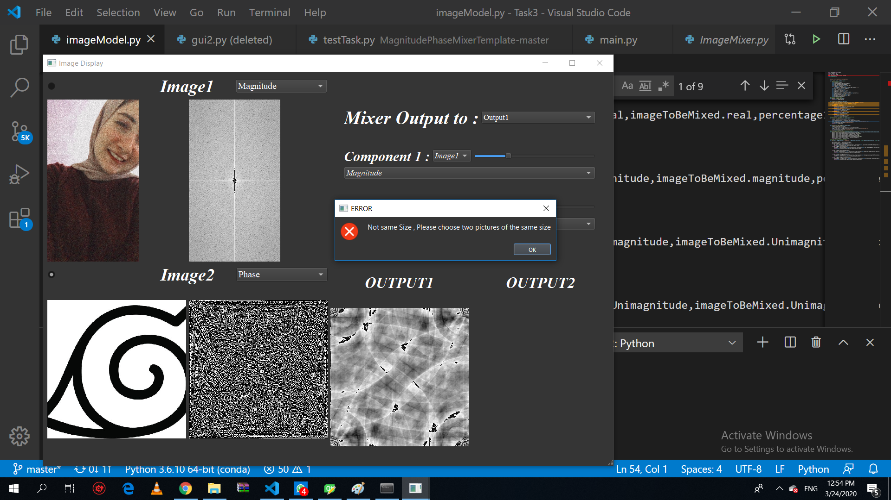
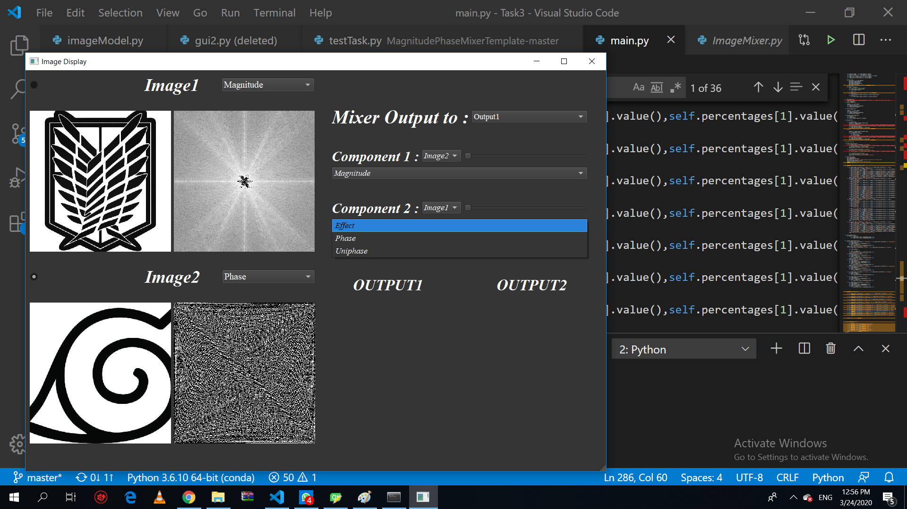

### Name: Marwa Abdullah
### ID: 28
### Sec :2

# MagnitudePhaseMixerTemplate

### **Test Result** :

### **Steps to run project** :
* Run main.py --> python main.py
* Open image by clicking on radiobtn1 or radiobtn2 
* Choose desired component of the image to be displayed
* Choose output1 or output2 to display output of mixing in 
* Choose image one or two in first component and second component to be mixed
*Choose the desired component of the first chosen image and second chosen image 
* Move Slider to which Percentage you want from the component

### **Demo pictures:**
##### Real and Imaginary

#### Real&Imaginary Vs Mag&Phase

#### Magnitude and Uniphase

#### Error ,two images are not of the same size

#### Other unwanted Choices are Hidden
